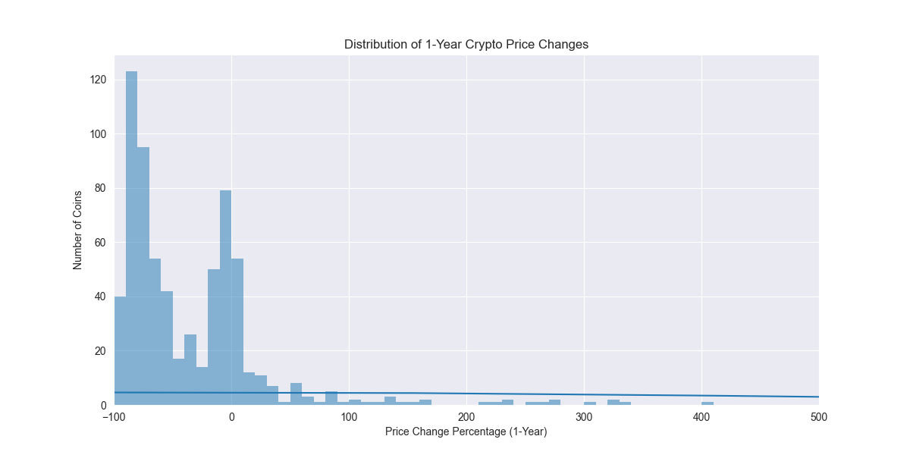
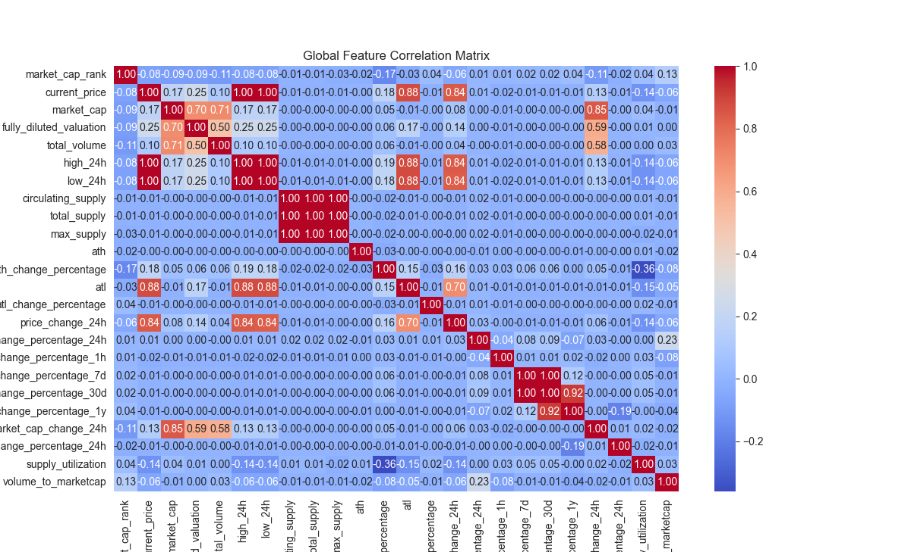
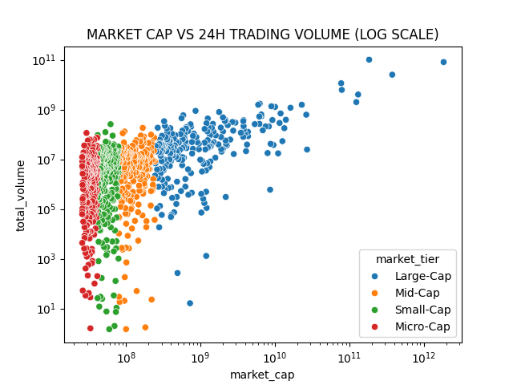
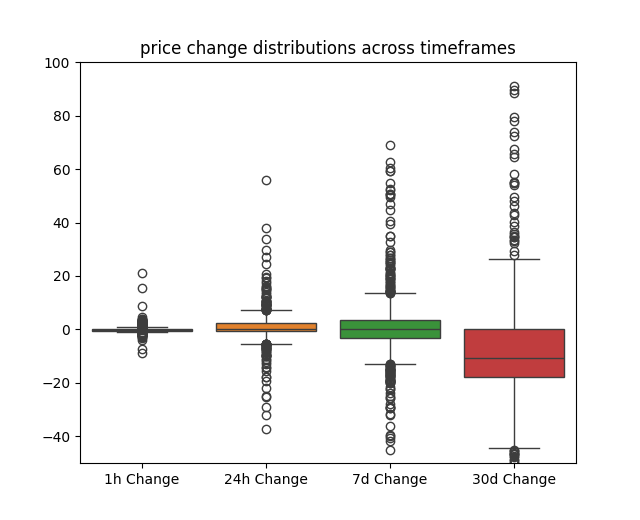
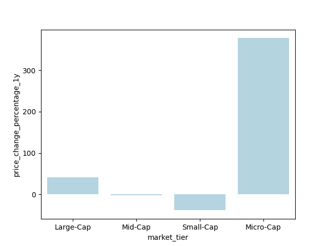
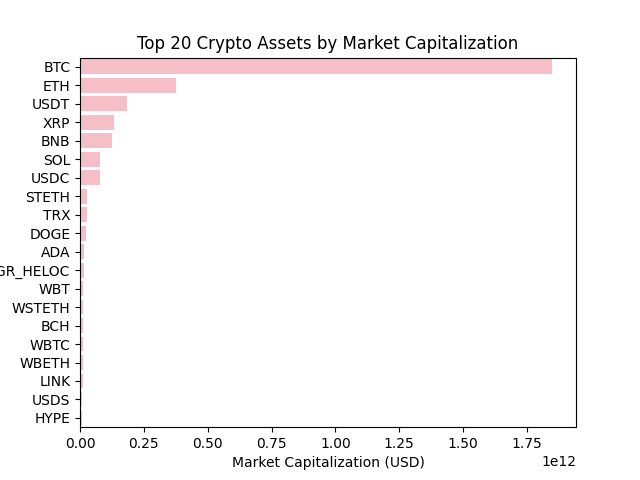

# Crypto Exploratory Data Analysis & Feature Engineering Pipeline

> A production-grade quantitative analysis pipeline processing 1,000 cryptocurrency assets across 30 structural parameters — engineered for downstream ML model input preparation.

**Author:** Thoshith | BA/AI @ UTD | [GitHub](https://github.com/RishxGit) · [LinkedIn](#)

---

## 1. Project Overview

This pipeline performs full-spectrum exploratory data analysis and feature engineering on the top 1,000 cryptocurrencies by market capitalization. The goal is not just to describe the data — but to clean it, engineer meaningful features, and expose the statistical structures that drive ML model performance downstream.

This is **Part 2** of an ongoing crypto intelligence series:

| Part | Project | Tech |
|---|---|---|
| 1 | SQL Market Intelligence | MySQL |
| 2 | Python EDA + Feature Engineering (this) | Pandas · NumPy · Matplotlib · Seaborn |
| 3 | ML Price Prediction (coming) | PyTorch + scikit-learn |
| 4 | RAG Financial Analyzer (coming) | LangChain + LLM API |

---

## 2. Technical Stack & Architecture Flow

**Stack:** Python 3.13+ · Pandas · NumPy · Matplotlib · Seaborn

**Pipeline:**

```
Raw CSV Ingestion
       ↓
Structural Preprocessing
(null profiling, dtype conversion, boolean flags)
       ↓
Vectorized Feature Engineering
(np.select(), ratio calculations, discretization)
       ↓
DataFrame Analytics
(groupby aggregations, correlation matrices, outlier detection)
       ↓
Data Visualization Rendering
(6 production charts saved as .png)
```

---

## 3. Data Cleansing & Architectural Choices

This section documents the engineering decisions made during preprocessing — choices that separate clean ML-ready data from naive analysis.

### Preserving Gaps via Masking
The `price_change_percentage_1y` column contains 323 missing entries. A naive approach would fill these with `0`. This was explicitly refused.

Filling with `0` introduces severe mathematical bias — these projects did not return 0% last year, they simply did not exist 365 days ago. Treating non-existence as zero-performance corrupts any downstream model trained on this feature.

Instead, affected rows were isolated into a non-destructive temporary workspace (`df_yearly`) preserving the original DataFrame's integrity while enabling clean yearly-only analytics.

### Structural Audits
- Converted raw time string variables (`ath_date`, `atl_date`) into timezone-aware calendar objects (`datetime64[ns, UTC]`) enabling precise temporal distance calculations
- Created a boolean flag column `has_max_supply` to securely track infinite inflation structures — 435 assets (43.5%) feature uncapped token emission with no hard supply ceiling

---

## 4. Features Engineered

All features were built using high-speed vectorized matrix operations — no Python loops.

| Feature | Method | Description |
|---|---|---|
| `market_tier` | `np.select()` | Segments 1,000 continuous rankings into 4 discrete operational groups: Large / Mid / Small / Micro Cap |
| `volume_to_marketcap` | Vectorized division | Scale-invariant capital velocity ratio — measures transaction intensity against underlying valuation |
| `perf_category` | `np.select()` | Discretizes continuous 1-year returns into distinct momentum states: BULLISH / FLAT/SIDEWAYS / BEARISH |
| `has_max_supply` | `.notnull()` | Boolean inflation risk flag — True if coin has a hard supply cap |

---

## 5. Key Analytical Findings

**1-Year Profitability Reality**
Only **20.24%** of mature crypto assets sustained a profitable position over a rolling 365-day window. Nearly 80% of the market destroyed capital — confirming extreme long-tail drawdown risk in this asset class.

**Asymmetric Tier Return Variance**
Annual returns diverge violently across market size groups:

| Market Tier | Avg 1-Year Return |
|---|---|
| Large Cap | +41.56% |
| Mid Cap | -2.40% |
| Small Cap | -38.48% |
| Micro Cap | +377.59% |

Micro-Cap positive skewness is driven by extreme speculative pumps, not fundamental growth.

**The 3-Sigma Anomaly Exception**
Applying a strict 3-standard-deviation boundary above the global price mean isolates exactly **30 price outliers** from 1,000 assets. A stark structural pattern emerges: **100% of global price outliers are Bitcoin or Bitcoin-derived synthetic assets** (WBTC, CBBTC, FBTC, SOLVBTC) — all trading near $92,000+.

**Bivariate Multi-Collinearity**
Pearson correlation between `market_cap` and `total_volume` = **0.71** — a strong linear relationship that remains statistically safe to retain as a paired ML model input without introducing harmful collinearity.

Conversely, `current_price`, `high_24h`, and `low_24h` hit a perfect correlation of **1.00** — absolute data redundancy. Two of these three features should be dropped before any ML training.

**Synchronized All-Timeframe Momentum**
Filtering for assets positive across all 5 time windows simultaneously (1h AND 24h AND 7d AND 30d AND 1y > 0) surfaces only **25 assets — 2.5% of the market** — heavily populated by dollar-pegged stablecoins (USDC, USDS, PYUSD).

**High-Velocity Capital Drivers**
ESPORTS dominates global transaction velocity with a volume-to-market-cap ratio of **4.15** — meaning its entire market value traded more than 4 times in a single 24-hour window.

**Supply Maturity**
Exactly **173 out of 1,000 coins** have over 90% of maximum supply in active circulation — including BTC at 95.03%, BCH at 95.06%, and WBTC at 100.00%. These assets carry the lowest inflation dilution risk.

---

## 6. Embedded Pipeline Graphics 

### 1-Year Return Distribution 
 

Exposes a distinct **bimodal distribution** — asset frequencies cluster at two psychological thresholds: a massive liquidation wall at **-90%** and a survival cluster near break-even at **0%**. Almost nothing distributes normally. 

### Correlation Heatmap 
 

Maps full multi-collinearity across all numerical features. Daily high and low values show a **perfect 1.00 redundancy** with current price — confirming these are structurally identical features that must be collapsed before ML training. 

### Market Cap vs Volume — Log Scale 
 

Logarithmic coordinate transformation (`plt.xscale('log')`) compresses exponential valuation gaps to expose a tight linear ascending capital slope. Severe outliers fall below the diagonal cloud — projects with large valuations but near-zero trading liquidity. 

### Volatility Expansion by Timeframe 


Distribution boxes and outlier whiskers expand dramatically as holding windows stretch from 1 hour to 30 days. Median returns systematically migrate downward as time horizons broaden — confirming that short-term volatility compounds into long-term wealth destruction for most assets. 

### Average Yearly Return by Market Tier 


Visualizes the extreme performance divergence between Large Cap stability (+41.56%) and Micro Cap speculative explosiveness (+377.59%). 

### Top 20 Coins by Market Cap 
 

Exposes the extreme power-law distribution governing the sector — a tiny cluster of assets in the hundreds of billions while the remaining long-tail flattens toward zero.

---

## 7. Operational Instructions

```bash
# Clone the repository
git clone https://github.com/RishxGit/crypto-python-eda
cd crypto-python-eda

# Install dependencies
pip install -r requirements.txt

# Run the pipeline
python3 crypto.py
```

**Requirements:**
```
pandas
numpy
matplotlib
seaborn
```

---

## 8. Repository Structure

```
crypto-python-eda/
├── crypto.py                  — main analysis pipeline
├── crypto_top1000_dataset.csv — raw dataset
├── requirements.txt           — dependencies
├── visuals/                   — all 6 saved chart outputs
│   ├── histogram_yearly_returns.png
│   ├── correlation_heatmap.png
│   ├── scatter_marketcap_volume.png
│   ├── boxplot_volatility.png
│   ├── bar_tier_returns.png
│   └── bar_top20_marketcap.png
└── README.md
```

---

*Data source: CoinGecko API via Kaggle — December 2024 snapshot. Not financial advice.*
EOF
